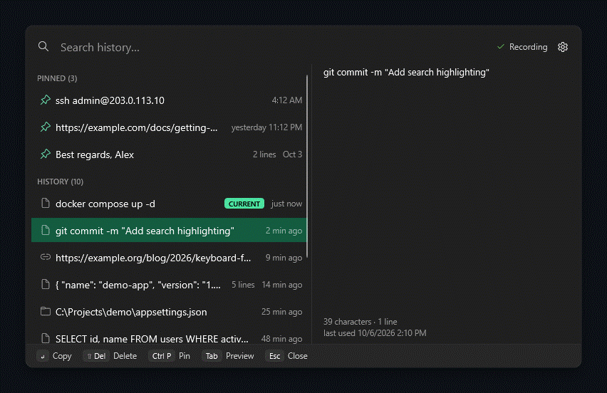
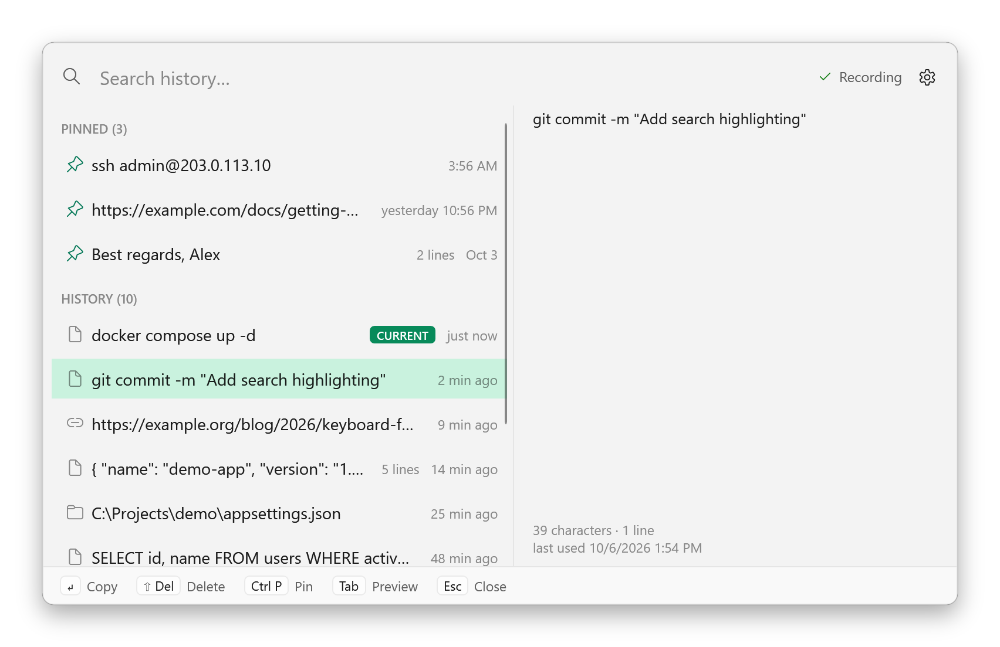
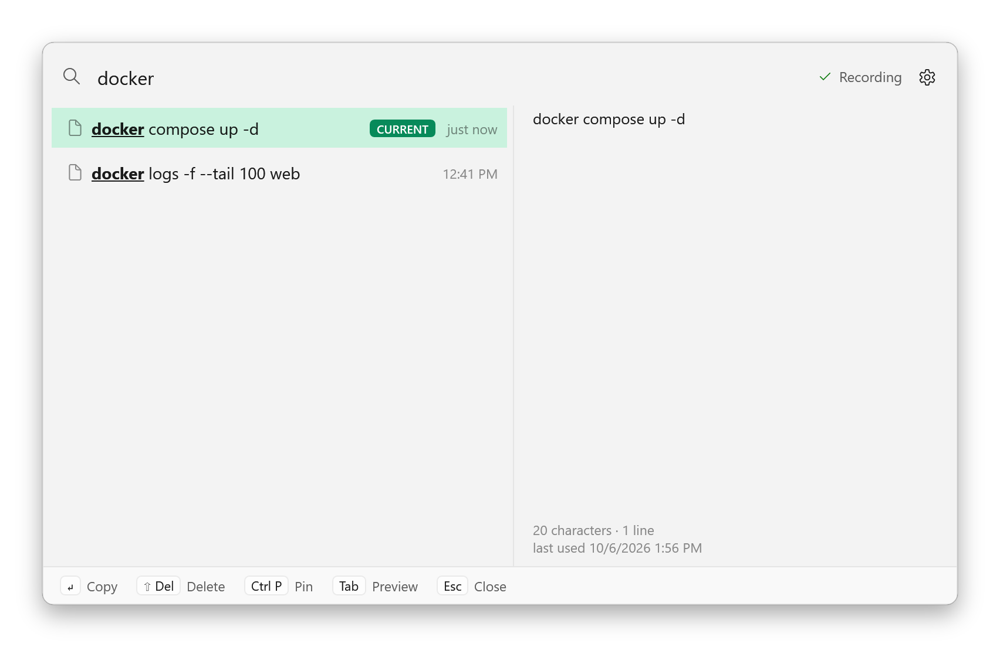
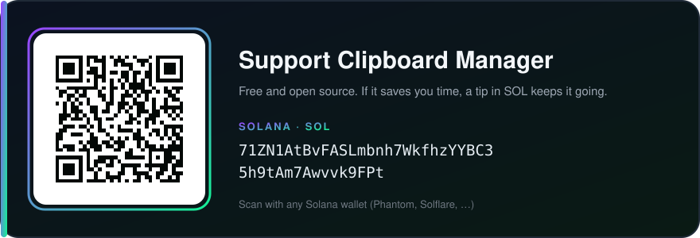

<div align="center">

<picture>
  <source media="(prefers-color-scheme: dark)" srcset="assets/readme/hero-dark.svg">
  <source media="(prefers-color-scheme: light)" srcset="assets/readme/hero-light.svg">
  
</picture>

<br>

[](https://github.com/Secoolioo/clipboard-manager/releases/latest)
[](https://github.com/Secoolioo/clipboard-manager/actions/workflows/ci.yml)
[](LICENSE)
[](#requirements)

**A fast, private clipboard history for Windows.**<br>
Copy as usual. Press <kbd>Ctrl</kbd>+<kbd>Shift</kbd>+<kbd>V</kbd>. Find anything you copied – even after a reboot.

<sub>Free &amp; open source · one portable EXE, no installer, no admin rights · Windows 10 / 11 · x64 + ARM64 · updates in one click</sub>

[**⬇ Download for Windows**](https://github.com/Secoolioo/clipboard-manager/releases/latest/download/ClipboardManager.exe) ·
[Website](https://secoolioo.github.io/clipboard-manager/) ·
[Features](#features) ·
[Shortcuts](#keyboard-first) ·
[Privacy](#privacy) ·
[Performance](#performance) ·
[Build](#build-from-source) ·
[Feedback](https://github.com/Secoolioo/clipboard-manager/discussions) ·
[Support](#support-the-project)

</div>

---

<p align="center">
  
</p>

## What it is

Clipboard Manager runs quietly in the notification area and remembers the text you copy. When you
need something again, one shortcut opens a small, keyboard-first window: type a few letters, press
<kbd>Enter</kbd>, and the entry is back in your clipboard – and focus is back in the app you came
from, so <kbd>Ctrl</kbd>+<kbd>V</kbd> just works.

It is built to be installed once and then forgotten: one EXE, starts with Windows, no account, no
cloud, no telemetry, and practically zero load while you are not using it.

### Why not just Win+V?

| | Windows clipboard history (Win+V) | Clipboard Manager |
|---|---|---|
| Entries | 25 | 100 by default, up to 5,000 |
| After a restart | cleared (except pinned) | kept |
| Search | – | instant, as you type |
| Exclude apps | – | yes (best effort, see [Privacy](#privacy)) |
| Password-manager markers | respected | respected |
| Sync to the cloud | optional | never – local only |
| Images, HTML | yes | not yet (text only) |

### And Ditto or CopyQ?

Both are excellent and do more – images, sync, scripting, lots of options. Clipboard Manager is
deliberately smaller: zero configuration, a window that is ready the moment you press the shortcut,
focus that returns to where you were, a modern Windows 11 look, and a strict local-only design.
If that is what you want from a clipboard tool, give it a try – and
[tell us what is missing](https://github.com/Secoolioo/clipboard-manager/discussions/categories/ideas).

## Features

<table>
<tr>
<td width="50%" valign="top">

**⚡ Instant**<br>
The window is pre-built in the background and opens in ~8 ms. Search over 5,000 entries takes
well under a millisecond.

**⌨️ Keyboard-first**<br>
Everything works without a mouse: type, arrows, <kbd>Enter</kbd>, <kbd>Esc</kbd>.

**📌 Pins**<br>
Keep frequently used snippets forever – pins never fall out of the history.

**🔁 Smart duplicates**<br>
Copying something again moves it to the top instead of adding a second row.

</td>
<td width="50%" valign="top">

**🔒 Private by design**<br>
Never goes online on its own – only when you click *Check for updates*, and then only to GitHub.
Honors the "do not record" markers of password managers and private browser windows. Hides itself
from screen sharing.

**⏸️ Pause anytime**<br>
5 min, 30 min, 1 hour or until you resume – or just "ignore the next copy".

**🎨 Looks like Windows 11**<br>
Fluent design, light, dark or system theme, follows your accent color.

**🌍 English & German**<br>
Follows your Windows language, switchable in Settings.

**🔄 One-click updates**<br>
*Check for updates* installs a new version in place – verified, settings and history kept.

</td>
</tr>
</table>

<p align="center">
  <picture>
    <source media="(prefers-color-scheme: dark)" srcset="assets/readme/popup-dark.png">
    
  </picture>
</p>

## Download

1. Download **[ClipboardManager.exe](https://github.com/Secoolioo/clipboard-manager/releases/latest/download/ClipboardManager.exe)**
   from the [latest release](https://github.com/Secoolioo/clipboard-manager/releases/latest)
   (`ClipboardManager-arm64.exe` for ARM PCs, or the smaller `ClipboardManager-x64.zip`).
2. Put it in a permanent folder, for example `%LOCALAPPDATA%\Programs\ClipboardManager\`.
3. Double-click it. A short welcome window confirms it is running and starts with Windows.

That's it – there is nothing to install. The EXE is large (~140 MB) because it contains the
complete .NET runtime; in exchange it needs no installation and stays at ~35 MB of memory.

A short tour, the FAQ and the same downloads are also on the
[website](https://secoolioo.github.io/clipboard-manager/).

> [!NOTE]
> Early releases are not code-signed yet. Windows SmartScreen will say *"Windows protected your PC"*:
> click **More info → Run anyway**. On PCs with **Smart App Control** turned on, unsigned apps cannot
> start at all; signing is planned (see [Code signing policy](CODE_SIGNING_POLICY.md)).

**Verify your download** – every release publishes SHA-256 hashes and a GitHub build attestation:

```bash
gh attestation verify ClipboardManager.exe --repo Secoolioo/clipboard-manager
```

### Updating

*Settings → About → **Check for updates*** (or *Check for updates…* in the tray menu). If a newer
release exists, **Install update** downloads the EXE for your PC, accepts it only if its size and
SHA-256 match the release's `SHA256SUMS.txt`, replaces the EXE in place and restarts the app.
Settings, history, pins and autostart stay as they are. The app never checks on its own. If the EXE
sits in a folder that needs administrator rights (e.g. *Program Files*), it says so and offers the
releases page instead – it never asks for elevation.

### Requirements

- Windows 11 (supported) or Windows 10 22H2 (best effort), x64 or ARM64
- No .NET installation needed

## Keyboard first

| Key | Action |
|---|---|
| <kbd>Ctrl</kbd>+<kbd>Shift</kbd>+<kbd>V</kbd> | Open / close the history (changeable) |
| *type* | Filter as you type (all words must match) |
| <kbd>↑</kbd> <kbd>↓</kbd> <kbd>PgUp</kbd> <kbd>PgDn</kbd> | Move the selection |
| <kbd>Enter</kbd> or click | Copy the entry, close, return to the previous app |
| <kbd>Ctrl</kbd>+<kbd>P</kbd> | Pin / unpin |
| <kbd>Shift</kbd>+<kbd>Del</kbd> | Delete the entry (<kbd>Ctrl</kbd>+<kbd>Z</kbd> brings it back) |
| <kbd>Tab</kbd> | Show / hide the preview pane |
| <kbd>Esc</kbd> | Close |

The newest entry is usually what is already in your clipboard, so the window pre-selects the one
*before* it: <kbd>Ctrl</kbd>+<kbd>Shift</kbd>+<kbd>V</kbd>, <kbd>Enter</kbd>, <kbd>Ctrl</kbd>+<kbd>V</kbd>
pastes your previous copy.

> [!TIP]
> <kbd>Ctrl</kbd>+<kbd>Shift</kbd>+<kbd>V</kbd> is also "paste as plain text" in some apps (Word,
> Teams, browsers) and "paste" in Windows Terminal. If you rely on that, pick another shortcut in
> Settings. If the shortcut is already taken when the app starts, it falls back to
> <kbd>Win</kbd>+<kbd>Alt</kbd>+<kbd>V</kbd> and tells you.

## Privacy

A clipboard manager sees everything you copy, so privacy is not a feature here – it is the design.

**What the app guarantees (and tests in CI):**

- **No network access unless you ask for it.** No telemetry, no automatic update checks, no
  account. Only a click on *Check for updates* contacts GitHub (the API, then the release download),
  and nothing about you or your clipboard is sent. A test fails the build if networking code
  appears anywhere outside the updater or an unexpected native library is referenced.
- **Password managers are respected.** Content carrying the Windows "do not record" markers
  (`ExcludeClipboardContentFromMonitorProcessing`, `CanIncludeInClipboardHistory = 0`,
  `Clipboard Viewer Ignore`) is never read. KeePass, KeePassXC, Bitwarden, Proton Pass and
  Chrome/Edge password fields set them.
- **Deleted means deleted** – in the database file: deleted entries are overwritten
  (`secure_delete`) and the write-ahead log is truncated.
- **Logs never contain clipboard content**, not even in error messages.
- **Crash reports contain no memory contents** (Windows Error Reporting is told to skip the heap).
- **Hidden from screen sharing and recordings** (on by default).

**Controls:** pause (5 / 30 / 60 min or until resumed), *ignore next copy*, exclude apps,
"keep history in memory only" (unpinned entries never touch the disk), skip detected credentials
(private keys and tokens with unambiguous formats), clear history, *remove everything*.

**Honest limits:** the history database is stored unencrypted in your user profile
(`%LOCALAPPDATA%\Secoolioo\ClipboardManager`), protected by Windows file permissions like any app
data – software running under your account can read it. Physical remnants on SSDs, in shadow copies
or the page file can't be ruled out (use BitLocker). Windows does not always reveal which app
copied something, so app exclusions are best effort, and passwords cannot be recognized by their
shape – use *pause* or *ignore next copy* for those. Details: [docs/privacy.md](docs/privacy.md).

## Settings

<p align="center">
  <picture>
    <source media="(prefers-color-scheme: dark)" srcset="assets/readme/search-dark.png">
    
  </picture>
</p>

Start with Windows (with a shortcut to the Windows startup-apps page) · Start menu entry · record on/off · language · shortcut recorder (rejects
combinations that would break copy/paste) · maximum entries (25 – 5,000) · memory-only history ·
clear history · detected-credential filter · screen-capture hiding · excluded apps (with "last
ignored" status) · theme · check for updates · open data folder · licenses · remove everything.

**Start with Windows** is on after the first start from a permanent folder (Downloads and Desktop
count; a ZIP opened in Explorer, `%TEMP%`, USB sticks and network shares do not, because the EXE
would soon be gone). It uses the regular per-user *Run* entry, so it shows up as *Clipboard
Manager* – and can be turned off – in Settings → Apps → Startup and Task Manager → Startup apps as
well as in the app's own settings. The app never re-enables it behind your back.

At sign-in the app starts quietly: no window, no notification, no focus change. Clipboard capture
and the shortcut work immediately; for the first 45 seconds (or until you first open the app) it
runs at below-normal priority and leaves the rest of its warm-up for later, so it does not slow
down your login. Notices from that phase wait until you first open the history or the tray menu
(at most 45 seconds).

## Performance

Measured on a Windows 11 laptop with the published single-file EXE ([methodology](docs/performance.md)):

| | |
|---|---|
| Memory while idle (private bytes) | **~33–35 MB** |
| CPU while idle | **~0.01 %** (15.6 ms of CPU time in 120 s) |
| Opening the window (warm) | **~8 ms** median, 14 ms max |
| Search, 5,000 typical entries | **0.17 ms** median |
| Search, 5,000 × 4,096-character entries | 3.2 ms median |
| Start (second and later starts) | ~1 s |

No polling: the app reacts to Windows clipboard notifications and sleeps otherwise. It renders in
software on purpose – for this small UI that saves ~90 MB of memory with no visible difference.

## Build from source

```bash
git clone https://github.com/Secoolioo/clipboard-manager.git
cd clipboard-manager
dotnet test --solution ClipboardManager.sln
dotnet publish src/ClipboardManager -c Release -r win-x64 -o publish
```

Requires the .NET SDK pinned in [`global.json`](global.json). The project layout and design
decisions are described in [docs/architecture.md](docs/architecture.md).

## Contributing

Bug reports, ideas and pull requests are welcome – see [CONTRIBUTING.md](CONTRIBUTING.md).
Questions and ideas go to [Discussions](https://github.com/Secoolioo/clipboard-manager/discussions),
bugs to [Issues](https://github.com/Secoolioo/clipboard-manager/issues/new/choose). Want to add a
language? The UI texts live in two files – see [Translations](CONTRIBUTING.md#translations).
Security issues: please follow [SECURITY.md](SECURITY.md).

## Support the project

Clipboard Manager is free, open source and ad-free. If it saves you time, a small tip keeps it going.

<p align="center">
  
</p>

**Solana (SOL):**

```text
71ZN1AtBvFASLmbnh7WkfhzYYBC35h9tAm7Awvvk9FPt
```

## License

Copyright © 2026 Secoolioo and contributors.

Clipboard Manager is free software: you can redistribute it and/or modify it under the terms of
the [GNU General Public License v3.0 or later](LICENSE). It comes with absolutely no warranty.
Third-party components are listed in [THIRD-PARTY-NOTICES.md](THIRD-PARTY-NOTICES.md).
